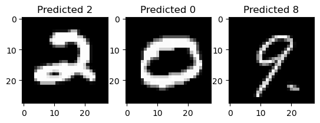

# Vision Transformer (ViT) from scratch

This project implements a Vision Transformer (ViT) model for classifying handwritten digits from the MNIST dataset.

## Project Structure

* **`vis-transformer.py`** : Contains the implementation of the Vision Transformer model.
* **`training_and_eval.ipynb`** : Data preperation, training and evaluation of the ViT model on the MNIST dataset.

## Model Architecture

The Vision Transformer (ViT) model consists of the following components:

1. **Patch Embedding Layer** : Converts the input image into a sequence of patches and projects them into a higher-dimensional embedding space.
2. **Transformer Encoder** : A stack of transformer encoder layers that process the sequence of patch embeddings.
3. **MLP Head** : A simple feed-forward network that classifies the output of the transformer encoder.

### Key Hyperparameters

* **Image Size** : 28x28 (MNIST images)
* **Patch Size** : 4x4
* **Embedding Dimension** : 16
* **Number of Transformer Encoder Layers** : 4
* **Number of Attention Heads** : 8
* **Hidden Dimension** : 768
* **Dropout Rate** : 0.001
* **Activation Function** : GELU

## Training

The model is trained using the Adam optimizer with the following settings:

* **Learning Rate** : 0.0001
* **Weight Decay** : 0.0001
* **Batch Size** : 512
* **Epochs** : 50
* **Early Stopping** : Patience of 3 epochs

### Data Augmentation

The training data is augmented using random affine transformations, including rotation, translation, and scaling.

## Evaluation

The model is evaluated on a validation set, and the best model is saved based on the validation loss. The training and validation accuracy and loss are logged for each epoch.

## Results

**Validation Accuracy (Epoch 50)** : 87.05%

## Acknowledgments

* The Vision Transformer (ViT) architecture is based on the paper [&#34;An Image is Worth 16x16 Words: Transformers for Image Recognition at Scale&#34;](https://arxiv.org/abs/2010.11929) by Dosovitskiy et al.
* The MNIST dataset is available at [Kaggle](https://www.kaggle.com/competitions/digit-recognizer)

---
